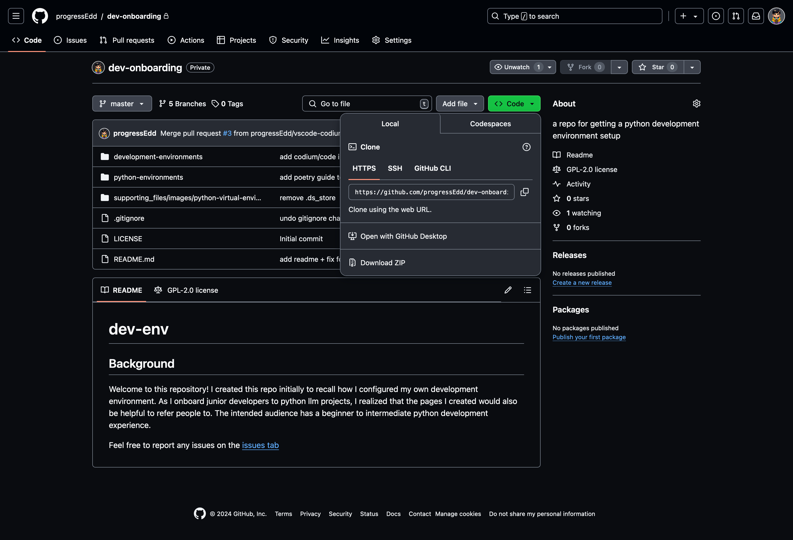
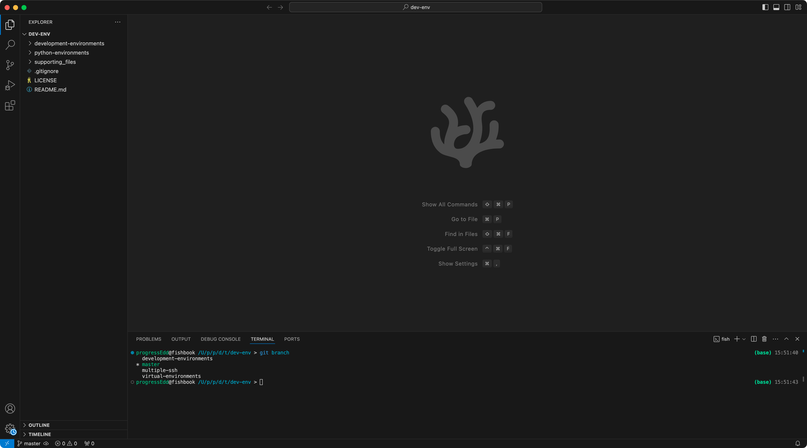

# Introduction to git
## Background
Git is a version control system used in software development environments and organizations. Version control software aims to keep track of changes in code and other files while collaborating within a development team. Websites such as [GitHub](https://github.com/) and [Gitlab](https://about.gitlab.com/) host and maintain code repos.

## Common workflow
1. Clone an existing repo
    - I recommend using the vscodium/code terminal to clone repos as the terminal history is stored within your workspace. You can use the following command in any terminal within a folder you wish to store the repo within, just make sure to navigate to the desired directory. 
        ```
        git clone https://github.com/progressEdd/dev-onboarding.git
        ```
      - Replace the url (https://github.com/progressEdd/dev-onboarding.git) with either the `HTTPS` or `SSH` options
        - You can find it within the code tab of Github or Gitlab
          - 
2. Checkout a branch
    1. Within the terminal that has cloned the repo, navigate to the newly cloned repo folder using the `cd $repo-folder` command. Replace `$repo-folder` with the newly cloned folder
    2. Within the folder run `git branch` to get the available branches
      - 
      - The output will show the available branches to select from. 
    3. Select the branch you wish to work with run the following command
        ```
        git checkout $desired-branch
        ```
         - Replace `$desired-branch` with an available branch from the `git branch` command
         - If you wish to make your own branch based on the selected branch you can add the `-b` command to create a new branch based on the current checked out branch
            ```
            git checkout -b $my-modified-branch
            ``` 
            - Replace `$my-modified-branch` with the name you wish to create a branch on
3. Make modifications to the files
4. Commit changes
  - As you make changes, remember to commit them. The cadence of commits varies for each developer. Commit if you feel you have made progress or before you test your code. If something breaks, and you need to revert it, it will be easier to figure out which change caused it. 
  - Run the following commands in your terminal
    1. ```
        git status
        ```
        - The `git status` command will show you which files have been modified
    2.  ```
        git add $file-name
        ```
        - Replace `$file-name` with the name of a file
        - If you wish to add all modified files from the git status, the `-A` command will add all changes to files in a directory. If you wish to specify a specific file, you'll need to make sure to give the path relative (including subfolders if you create new folders) to the repo directory.
          - You can find examples of the available commands by running `git help add`. Use the arrow keys to scroll. If you done reading the documentation type `q`
            <blockquote>
            ...

              EXAMPLES
            •   Adds content from all *.txt files under Documentation directory and its subdirectories:

                    $ git add Documentation/\*.txt

                Note that the asterisk * is quoted from the shell in this example; this lets the command include the files from subdirectories of Documentation/ directory.

            •   Considers adding content from all git-*.sh scripts:

                    $ git add git-*.sh

                Because this example lets the shell expand the asterisk (i.e. you are listing the files explicitly), it does not consider subdir/git-foo.sh.
              ...
              </blockquote>
    3. ```
          git commit -m "added new feature to function a"
        ```
       - Feel free to replace the message `"added new feature to function a"` with a memorable message for your self. The quotes will allow spaces
5. Push changes
6. Submit Pull Requests for review
7. Merge changes from remote

## Glossary
- 