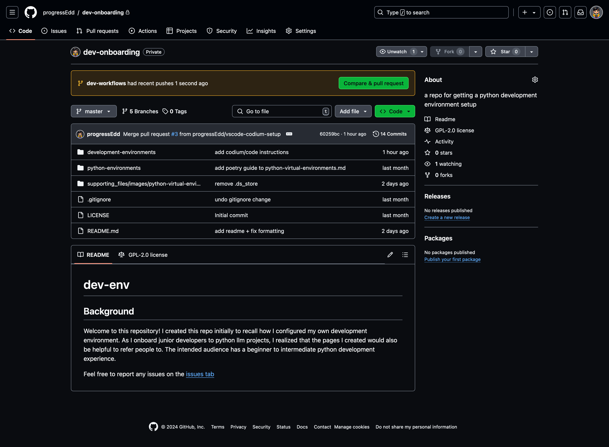

# Introduction to git
Chatgpt 4o helped write the overview, why use git, and glossary. If there are any terms or instructions that aren't clear or need additional explanations, feel free to copy the section and start a chat with a llm. As always, validate the suggestions using the internet or your seniors.

## Overview
Git is a powerful version control system that allows developers to track changes in their code and collaborate with others. It helps manage the evolution of projects, providing a history of changes, facilitating teamwork, and enabling efficient handling of different versions of a project.

## Why Use Git?
Imagine working on a project where you need to track every change, collaborate with multiple people, and ensure nothing gets lost. Git helps you by:

-   Keeping a detailed history of changes.
-   Allowing multiple people to work on the same project without conflicts.
-   Providing tools to revert to previous versions if something goes wrong.

## Background
Git is a version control system used in software development environments and organizations. Version control software aims to keep track of changes in code and other files while collaborating within a development team. Websites such as [GitHub](https://github.com/) and [Gitlab](https://about.gitlab.com/) host and maintain code repos. 

## Common workflow
Before running any of the commands within this workflow, please ensure that git is installed. Follow the instructions on [git textbook](https://git-scm.com/book/en/v2/Getting-Started-Installing-Git)
1. Clone an existing repo
    - I recommend using the vscodium/code terminal to clone repos as the terminal history is stored within your workspace. You can use the following command in any terminal within a folder you wish to store the repo within, just make sure to navigate to the desired directory. 
        ```
        git clone https://github.com/progressEdd/dev-onboarding.git
        ```
      - Replace the url (https://github.com/progressEdd/dev-onboarding.git) with either the `HTTPS` or `SSH` options
        - You can find it within the code tab of Github or Gitlab
          - 
2. Checkout a branch
    1. Within the terminal that has cloned the repo, navigate to the newly cloned repo folder using the `cd $repo-folder` command. Replace `$repo-folder` with the newly cloned folder
    2. Within the folder run `git branch` to get the available branches
      - 
      - The output will show the available branches to select from. 
    3. Select the branch you wish to work with run the following command
        ```
        git checkout $desired-branch
        ```
         - Replace `$desired-branch` with an available branch from the `git branch` command
         - If you wish to make your own branch based on the selected branch you can add the `-b` command to create a new branch based on the current checked out branch
            ```
            git checkout -b $my-modified-branch
            ``` 
            - Replace `$my-modified-branch` with the name you wish to create a branch on
3. Make modifications to the files
4. Commit changes
  - As you make changes, remember to commit them. The cadence of commits varies for each developer. Commit if you feel you have made progress or before you test your code. If something breaks, and you need to revert it, it will be easier to figure out which change caused it. 
  - Run the following commands in your terminal
    1. ```
        git status
        ```
        - The `git status` command will show you which files have been modified
    2.  ```
        git add $file-name
        ```
        - Replace `$file-name` with the name of a file
        - If you wish to add all modified files from the git status, the `-A` command will add all changes to files in a directory. If you wish to specify a specific file, you'll need to make sure to give the path relative (including subfolders if you create new folders) to the repo directory
          - You can find examples of the available commands by running `git help add`. Use the arrow keys to scroll. If you done reading the documentation type `q`
            <blockquote>
            ...

              EXAMPLES
            •   Adds content from all *.txt files under Documentation directory and its subdirectories:

                    $ git add Documentation/\*.txt

                Note that the asterisk * is quoted from the shell in this example; this lets the command include the files from subdirectories of Documentation/ directory.

            •   Considers adding content from all git-*.sh scripts:

                    $ git add git-*.sh

                Because this example lets the shell expand the asterisk (i.e. you are listing the files explicitly), it does not consider subdir/git-foo.sh.
              ...
              </blockquote>
    3. ```
          git commit -m "added new feature to function a"
        ```
       - Feel free to replace the message `"added new feature to function a"` with a memorable message for your self. The quotes will allow spaces
5. Push the local changes to remote
  - Run 
    - ```
      git push origin $branch-name
      ```
      - `origin` is your local copy of the repository. When we `push` we are sending it to the remote (GitHub/GitLab)
      - Replace `$branch-name` with the name of the current branch. Note: some repositories will restrict pushing to the master/main (repo home page)
6. Submit Pull Requests for review
  - When git has successfully pushed to a repo, you'll be prompted to create a pull request with a link. You can open the link or select the from the pull requests tab on the repo. If your push is recent, you can also click on the `Compare & pull request` The interface will vary for each website
    - 
  - Follow the steps in open a pull request tab. Some organizations will require a review and sign off from an admin
7. Merge changes from remote
  - If your pull request is accepted, you'll need to update your local repo with the latest. Run the following commands
    1. ```
       git status
       ```
      - Check if you have any uncommitted changes. If there are, follow the instructions for adding commits
      - If you wish to cache your local changes, a `git stash` will cache the changes. To apply the stashed changes to the updated code, run `git stash apply`
    2. ```
       git pull
       ```
        - git pull will grab the remote changes and attempt to merge it into your current branch. If you just wish to get updates, a `git fetch` will cache the new changes. You'll need to `checkout` to the individual branches and `merge` it with the cached updates. 

## Terminology

- `git`: A command-line application to manage and track file changes for a given project repository. For more information, I recommend reading the [git textbook](https://git-scm.com/book/en/v2).
  - `clone`: A git parameter used to download a repository.
  - `checkout`: A git parameter used to open a specific branch.
    - `branch`: A term used to refer to a particular version of the code repository.
  - `add`: A git parameter used to stage changes in your working directory for the next commit. It tells git that you want to include updates to a particular file in the next commit.
    - `stage`: The phase in git where changes are added to the index (or staging area) in preparation for a commit. This is done using the `git add` command. Staging allows you to prepare a snapshot of the changes you want to include in your next commit.
  - `commit`: A git parameter used to save and track changes. It creates a snapshot of the current changes in the repository.
    - `commit message`: A message associated with a commit that describes the changes made. It's important for understanding the history of changes in the repository.
  - `push`: A git parameter used to upload local repository content to a remote repository. It transfers commits from your local repository to a remote one.
    - `remote`: A common repository that all team members use to exchange their changes. It’s typically hosted on a server like GitHub or GitLab.
    - `origin`: The default name git gives to the server you cloned from. It serves as a shorthand for the remote repository URL.
  - `pull`: A git parameter used to fetch and integrate changes from a remote repository to your local repository.
  - `fetch`: A git parameter used to download objects and refs from another repository.
  - `merge`: A git parameter used to combine multiple sequences of commits into one unified history. It typically integrates changes from a different branch into your current branch.
  - `rebase`: A git parameter used to move or combine a sequence of commits to a new base commit. This can be used to synchronize a feature branch with an upstream branch.
    - `upstream`: The main repository that is considered the central repository from which to pull updates. It’s usually the repository from which your local repository was cloned.
  - `stash`: A git parameter used to temporarily save changes you don't want to commit immediately. It allows you to clean your working directory without committing.
  - `status`: A git command used to display the state of the working directory and the staging area. It shows which changes have been staged, which haven't, and which files aren't being tracked by git.
  - `diff`: A git parameter used to show the differences between commits, commit and working tree, etc.
  - `log`: A git parameter used to show the commit logs.

- Additional Developer Terms:
  - `repository (repo)`: A storage location for software packages, often used to refer to a directory or storage space where your project resides.
  - `HEAD`: A reference to the last commit in the currently checked-out branch.
  - `conflict`: Occurs when different changes in different branches interfere with each other and need to be resolved manually.
  - `pull request (PR)`: A method of submitting contributions to a project. It allows you to notify team members that you have completed a feature or fix and it is ready to be reviewed.
  - `fork`: A personal copy of someone else's project. It allows you to freely experiment with changes without affecting the original project.
  - `origin`: The original repository from which you have cloned your local repository.