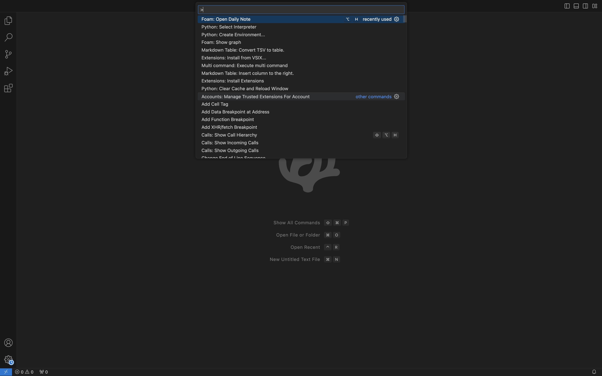
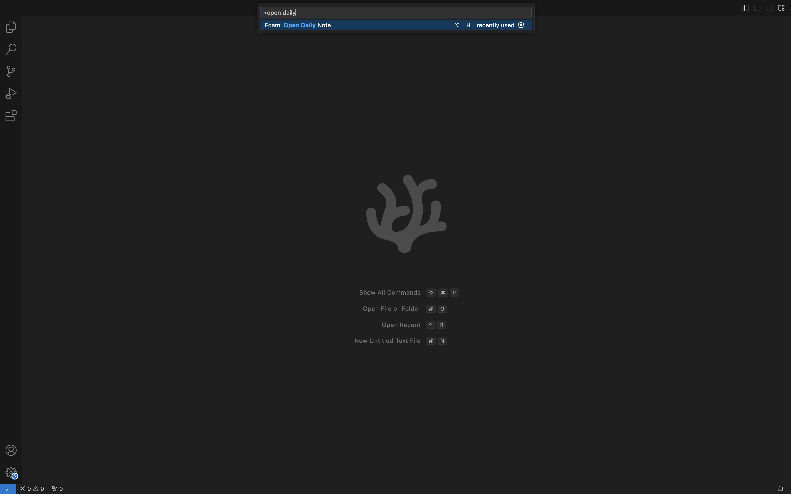
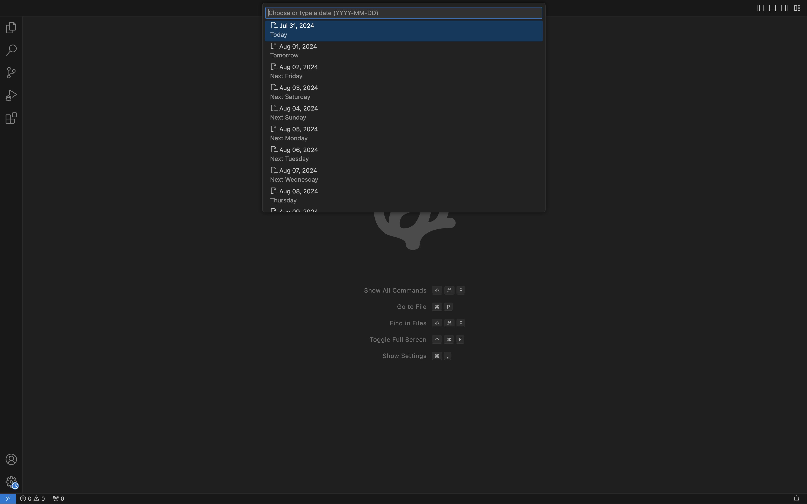
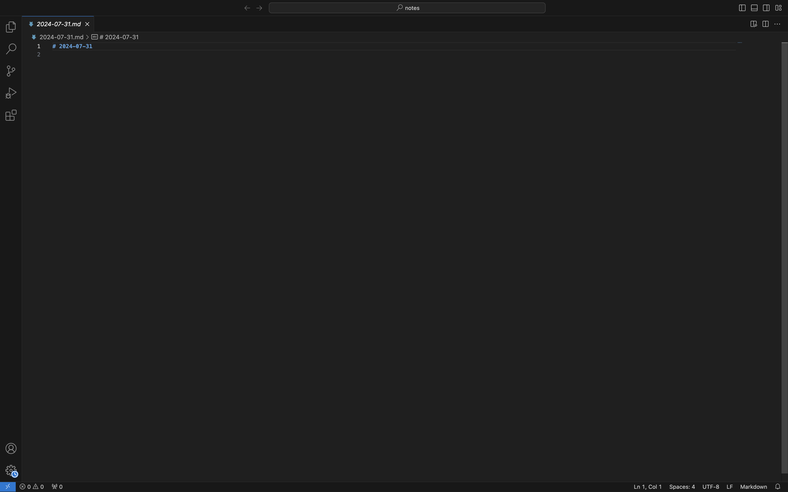
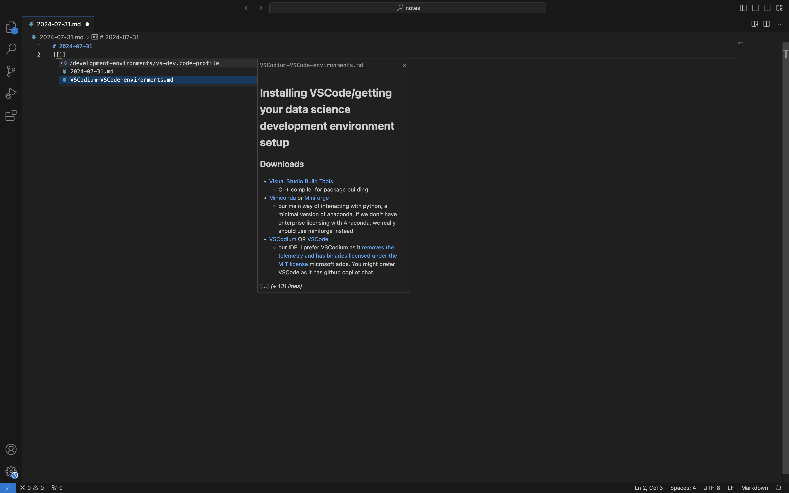
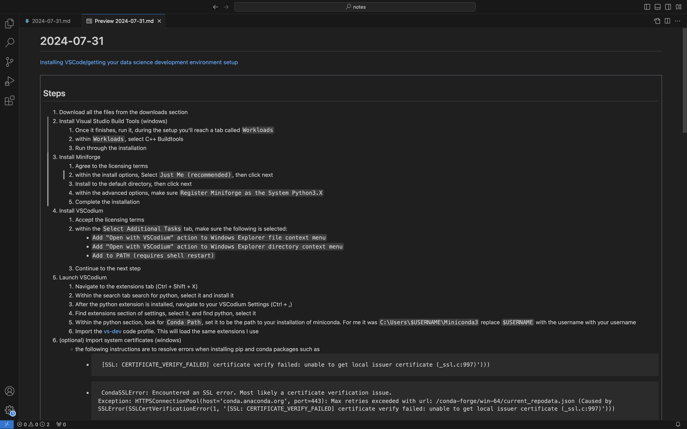
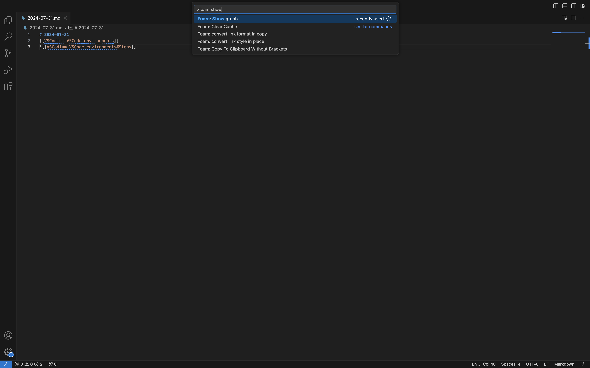
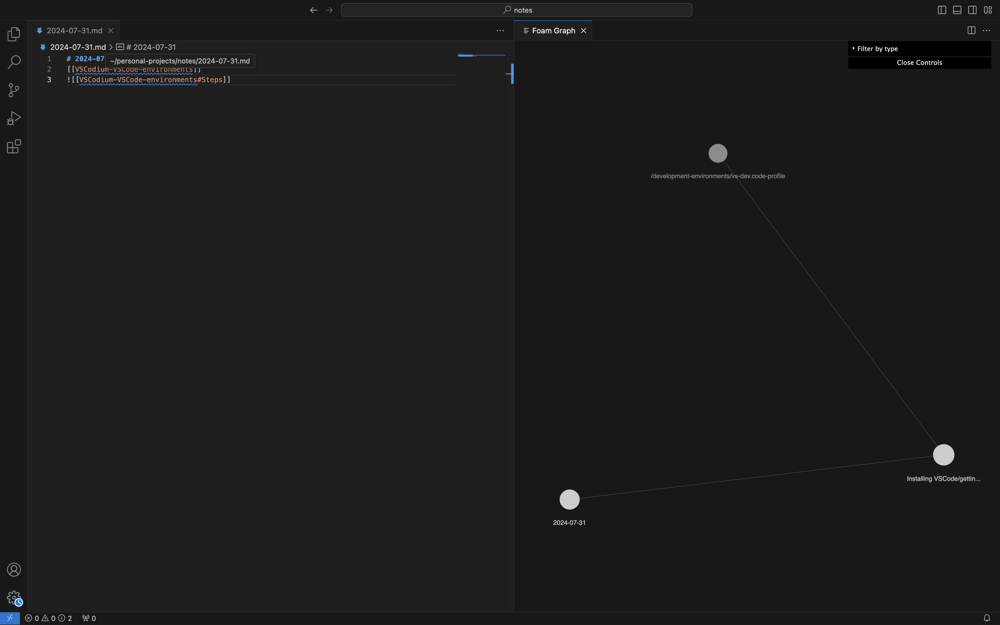

# Taking Notes with VS Codium/Code
If you followed the instructions from setting up your development environment [[VSCodium-VSCode-environments]], Foam will be installed on your vs profile. This document will introduce you to the basics of Foam and markdown for a better personal knowledge management.

## What note taking extensions have been installed?
- [Foam](https://marketplace.visualstudio.com/items?itemName=foam.foam-vscode)
  - For building a personal knowledge base
- [LTeX](https://marketplace.visualstudio.com/items?itemName=valentjn.vscode-ltex)
  - For markdown spell check
- [Markdown All in One](https://marketplace.visualstudio.com/items?itemName=yzhang.markdown-all-in-one)
  - For automatic markdown bullet points 
- [Markdown Paste](https://marketplace.visualstudio.com/items?itemName=valentjn.vscode-ltex)
  - For pasting images, as well as rich text

## What is Foam?
From the [documentation page](https://foambubble.github.io/foam/)
> Foam is a personal knowledge management and sharing system inspired by Roam Research, built on Visual Studio Code and GitHub.

## Creating notes
Foam is works with markdown. One of the features I use regularly is the daily notes. To create a note follow these steps
1. Toggle the vs command palette 
    - windows: `Ctrl` + `Shift` + `p`
    - mac: `command` + `shift` + `p`
2. The following command palette will be pulled up
    - 
3. Within the menu, type the following: `open daily `
    - 
      - if you see this prompt, hit the `Enter` / `return`key
4. You will now be prompted to select the day's notes. Select Today's note
    - 
5. Foam will now automatically a markdown file for today. For formatting, feel free to refer to the [[intro-to-notes#Markdown tips and tricks]]
    - 
    - Make sure to save every so often, as VS will cache the file. If you sync with OneDrive, your notes won't be uploaded if you do not save

## Foam tips and tricks
- These are not the only tips and tricks, refer to the documentation for other [features](https://foambubble.github.io/foam/#features)
- Use wiki links `[[$your_file_name_here]]` to backlink to other notes
  - For illustration, if you start by typing `[[]]`, the list of files, within the folder, will appear as suggestions with previews
    - 
  - For example: when I typed in `[[VSCodium-VSCode-environments]]`
    - [[VSCodium-VSCode-environments]] will link back to the file `VSCodium-VSCode-environments`
      - This is the raw code 
- Use wiki links and headings `![[$your_file_name_here#section_title]]` to embed other notes
  - For example: when I type `![[VSCodium-VSCode-environments#Steps]]` 
    - The output will look like this: make sure to enable the VS preview ()
      - preview
         - windows: `Ctrl` + `Shift` + `v`
         - mac: `command` + `shift` + `v` 
      - screenshot
        - 
      - ![[VSCodium-VSCode-environments#Steps]]
- As you build out your notes, foam will create a graph for all note references
  - Toggle the command palette and type in `foam show `
    - 
  - The following graph will pop up
    - 

## Markdown tips and tricks
- Pasting images
  - The setting in this profile has been configured to automatically will paste the image within the following path: `${workspaceRoot}/supporting_files/images/${fileBasenameNoExtension`. If the subfolders do not exist, it will create a new folder. 
    - Note: change `${workspaceRoot}` if you want images to be posted elsewhere. When drafting this, I opened the specific subfolder as my workspace using VS.
- Refer to the [original page](https://daringfireball.net/projects/markdown/)
- ### Headers
  - if you want to make a header add a new line with `#`
  - ### Examples
  - # I want to make something big and stand out
  - ## Adding additional `#`'s will make subheaders
  - ### Raw
  - ```md
    # I want to make something big and stand out
    ## adding additional `#`'s will make subheaders
    ```
- ### Bullet points
  - #### How to
  - if you want to add bullet points you can use `-` or `*`
  - for example
  - this is a bullet with a `-`
  * this is a bullet with a `*`
  - #### Raw
    ```md
    - this is a bullet with a `-`
    * this is a bullet with a `*`
    ```