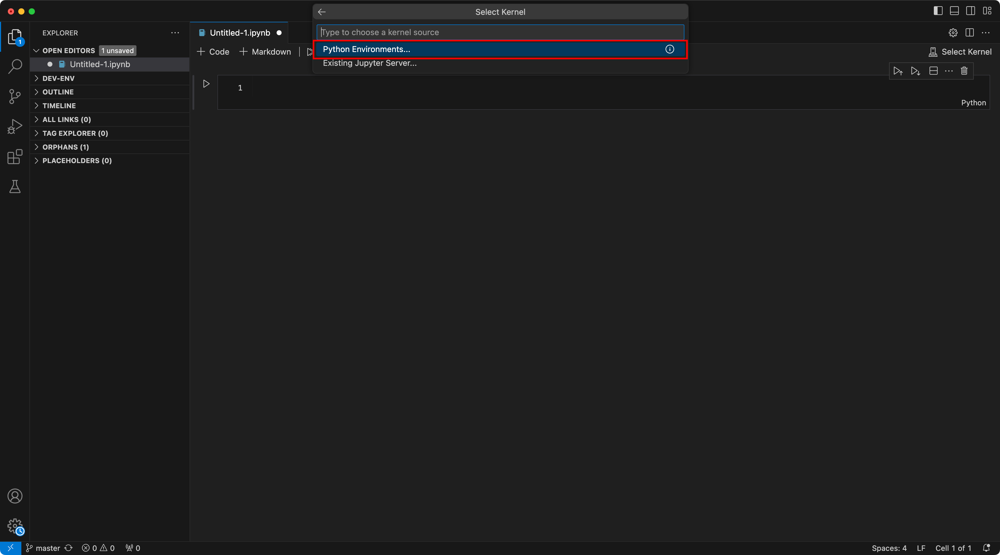

# Setting up poetry
This guide assumes that VSCode/VSCodium has been installed to your system

## Installing poetry following the developer's best practices

## Installing poetry within a conda environment
1. Open a terminal within VSCode
2. Activate your desired conda environment
    ```
    conda activate $your_conda_environment_name
    ```
    - if you do not have a environment feel free to run the following to build one using the following command, replace `$env_name` with a desired name for example `py311`, set the `$version` with desired python version for example `3.11`. I create conda environments for python versioning and use poetry to manage my packages. 
        ```
        conda create --name $env_name python=$version -c conda-forge  
        ```
3. Install poetry to your desired python environment with pip using the following command
    ```
    python -m pip install poetry 
    ```
4. Install Poetry conda
    ```
    python -m pip install poetry-conda
    ```
    - note: we are using `poetry-conda` as there has been [ongoing discussions for how poetry should interact with a conda environments](https://github.com/python-poetry/poetry/issues/4055#issuecomment-1474837400) without poetry-conda, the .venv will be installed within the `venvs` folder of conda, which slows down the process of detecting the python interpreter detection within VSCode
5. Configure poetry to dump the .venv within to your local directory
    ```
    poetry config virtualenvs.in-project true
    ```
6. Install the poetry packages, ensure that the `pyproject.tmol` file is accessible for your terminal. 
    ```
    poetry install --no-root
    ```
    - note: the `--no-root` flag will just install the required packages and avoid building the packages 
7. wait for the packages to install
8. When using notebooks make sure to select the local .venv for your python interpreter
    1. 
    2. 
    3. 
9. When using python or streamlit commands, make sure to activate the `poetry shell` to let the terminal know you want to use the python within the `.venv` folder

## Installing in your base environment
Follow these instructions to use poetry on your base environment.
1. Open a terminal within VSCode
2. Install poetry to your desired python environment with pip using the following command
    ```
    pip install poetry 
    ```
3. Configure poetry to dump the .venv within to your local directory
    ```
    poetry config virtualenvs.in-project true
    ```
4. Install the poetry packages, ensure that the `pyproject.tmol` file is accessible for your terminal
    ```
    poetry install --no-root
    ```
5. Wait for the packages to install
6. When using notebooks make sure to select the local .venv for your python interpreter
    1. 
    2. 
    3. 
7. When using python or streamlit commands, make sure to activate the `poetry shell` to let the terminal know you want to use the python within the `.venv` folder


## Additional poetry notes
- Poetry tracks package versions through the `pyproject.toml` and `poetry.lock` files, if new packages need to be installed, use the following command replace `$pip-package-name`
    ```
    poetry install $pip-package-name
    ```
- If you wish to get the pip requirements, run the following commands:
    1. Activate poetry shell
        ```
        poetry shell
        ```
    2.  Run pip commands
        ```
        pip list freeze
        ```
- If you wish to exit out of the poetry shell, run the command `exit` within the poetry shell
- (Advanced) Help the `.venv` version of python is not being activated, instead the base environment keeps getting activated
    1. Check the current activated python with the following command within your desired environment
        ```
        which python
        ```
    2. If the path does not match the local `.venv` folder, it might be due to your shell config with conda. When a `poetry shell` is launched, it will by default load your shell config, if your config contains a conda activation/initialization, the conda path will be selected. To resolve this add additional code within your shell to check if a .venv folder exists. I use fish shell and vim, so find the equivalent instructions to modify for your shell activation. Alternatively paste these instructions into a llm and have it give you the equivalent for your desired shell
        1. Edit your config with you're preferred terminal text editor. I use vim, feel free to substitute with nano. If you use bash you'll find your shell in `~/.bashrc`
            ```
            vim  ~/.config/fish/config.fish 
            ```
        2. Add logic to check for .venv folder, this is coded for fish shell, look up your shell equivalent. 
            - To insert this within vim hit the `i` key on your keyboard and navigate to the line you wish to insert the code into. In nano just navigate to the line you wish to add
            ```

            # Function to activate .venv if it exists
            function activate_venv
                if test -d .venv
                    set -x VIRTUAL_ENV (pwd)/.venv
                    set -x PATH $VIRTUAL_ENV/bin $PATH
                end
            end

            # >>> conda initialize >>> block

            activate_venv

            ```
        4. Save the changes
            - in vim:
                - hit the `Esc` key on your keyboard  
                - hit the `:` key on your keyboard when a cursor appears type `wq` this will write and quit vim
            - in nano:
                - hit the following keys `Control + X`, nano will prompt you to save, confirm save, and exit
        5. Reload your shell
            ```
            source ~/.config/fish/config.fish
            ```
- Should poetry causes issues, a fallback pip requirements file is included within the repo. I do not recommend this option as it does not create an environment and can potentially cause dependency conflicts. This should be considered a __full nuclear solution__.
    1. Navigate to the source directory
    2. Activate the desired environment to install pip packages to
    3. Run the following command within the directory
        ```
        pip install -r requirements.txt
        ```
    4. wait for the packages to install